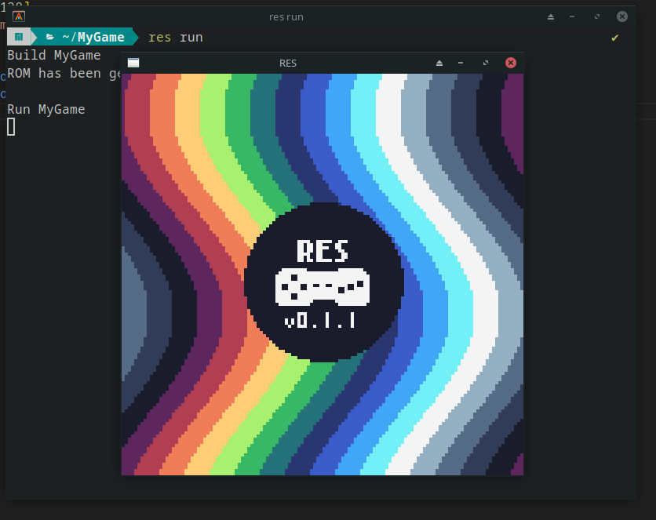

# RES

- [RES](#res)
  - [Overview](#overview)
  - [Installation](#installation)
  - [General concepts and architecture](#general-concepts-and-architecture)
    - [Initialization code example](#initialization-code-example)

## Overview

RES is a minimalist game engine designed for creating games with low-spec content. It is inspired by Pico-8 and other fantasy consoles.

RES is written in Haxe and extremely portable.

<table>
   <tbody>
      <tr>
         <td>
             
         </td>
         <td>
             
         </td>
         <td>
             
         </td>
      </tr>
   </tbody>
</table>

## Installation

1. Install Haxe following the instructinos on the [official website](https://haxe.org/)

2. Using `haxelib` (library manager utility for haxe) install RES. It is recommended to use the Git version as it is the most up to date version:

   ```
   haxelib git res https://github.com/RES-Haxe/res.git
   ```

   or you can install the Haxelib version:

   ```
   haxelib install res
   ```

3. Use the following command to setup the engine:

   ```
   haxelib run res setup
   ```

   In the end, you will be asked to register a global `res` command in the system. If you choose to do so, you will be able to use the commands as described below. Otherwise, you will need to prefix all the following commands with `haxelib run`.

4. To initialize a project use:

   ```
   res new MyGame
   ```

   This command will create a new directory called "MyGame" and initialize a project within it.

5. To run the project, use the following command in the project directory:

   ```
   res run
   ```

   After running this command, you should see a window that displays the splash-screen briefly, and then the blank screen will appear.

   

## General concepts and architecture

Think of RES as a virtual gaming console. Your program runs inside this console and has access to its resources, such as the frame buffer, read-only memory with game data, audio output device, and user input devices.

### Initialization code example

Let's have a look at the most basic code that initializes an instance of RES:

```haxe

#if hl
final bios = new res.bios.hl.BIOS("RES", 4);
#elseif js
final bios = new res.bios.html5.BIOS();
#else
#error
#end

function main() {

  RES.boot(bios, {            // (1)
    resolution: [128, 128],   // (2)
    rom: Rom.embed('rom'),    // (3)
    main: (res) -> {          // (4)
      return {
        update: (dt) -> {     // (5)
        },
        render: (fb) -> {     // (6)
          fb.clear();
        }
      }
    }
  });

}
```

1. The `RES.boot` function accepts two parameters.

   The first parameter is `bios`. In RES terminology, BIOS is a subsystem responsible for all the platform-dependent code, such as window creation, initializing the rendering context, capturing user input, and audio output, among others. There are pre-made "BIOSes" available for the [HashLink VM](https://github.com/RES-Haxe/res-hl) and [HTML5](https://github.com/RES-Haxe/res-html5). Additionally, some other "BIOSes" are currently under development, but it's also quite easy to implement your own BIOS.

   In this example, depending on the compilation target, either the HashLink or HTML BIOS will be used. For other targets, the compilation will fail.

   More details in the [BIOS](#bios) section of this documentation;

   The second parameter is the RES configuration, which contains several properties, including the following:

2. `resolution` determines the resolution used by the games. This value cannot be changed at runtime.

3. `rom`. In RES terminology, ROM refers to the storage for all the game data, including sprites, fonts, tile maps, tile sets, audio, and other necessary assets. There are several methods for creating a ROM. In this example, the content of the `rom` directory, located in the project's directory, is used to create the ROM and embed it directly into the code. This action occurs during compilation time. Alternatively, it is also possible to use an external file with packed ROM data or create this data at runtime.

   More details in the [ROM](#rom) section of this documentation.

4. `main`. This parameter determines the entry point to your game. It is a function that takes an instance of RES as an argument and returns an object with an `update` method, which accepts a single `Float` argument representing the time delta (in seconds), and a `render` method that takes a `FrameBuffer` as an argument. Whenever an instance of RES is booted and ready, this function will be called, passing the instance of RES as an argument.

   The returned object can be of any type as long as it has the `update` and `render` methods with the required signatures. It can be an instance of a class or an object with a different set of members. Additionally, you can utilize an instance of the `State` class provided by RES, which offers various utilities for managing the game state. For more details on this, please refer to the [State](#state) section of this documentation.

5. The `update` method will be called whenever there is a need to update the game state. The frequency of this update is determined by the BIOS.

6. The `render` method will be called each time the game needs to be rendered onto a [FrameBuffer](#framebuffer).
