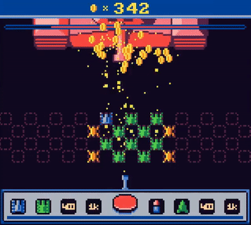

# RES

- [RES](#res)
  - [Overview](#overview)
  - [Installation](#installation)

## Overview

RES is a minimalist game engine designed for creating games with low-spec content. It is inspired by Pico-8 and other fantasy consoles.

RES is written in Haxe and extremely portable.

<table>
   <tbody>
      <tr>
         <td>
             
         </td>
         <td>
             
         </td>
         <td>
             
         </td>
      </tr>
   </tbody>
</table>

## Installation

1. Install Haxe following the instructinos on the [official website](https://haxe.org/)

2. Using `haxelib` (library manager utility for haxe) install RES. It is recommended to use the Git version as it is the most up to date version:

   ```
   haxelib git res https://github.com/RES-Haxe/res.git
   ```

   or you can install the Haxelib version:

   ```
   haxelib install res
   ```

3. Use the following command to setup the engine:

   ```
   haxelib run res setup
   ```

   In the end, you will be asked to register a global `res` command in the system. If you choose to do so, you will be able to use the commands as described below. Otherwise, you will need to prefix all the following commands with `haxelib run`.

4. To initialize a project use:

   ```
   res init MyGame 
   ```

   This command will create a new directory called "MyGame" and initialize a project within it.

5. To run the project, use the following command in the project directory:
   
   ```
   res run
   ```